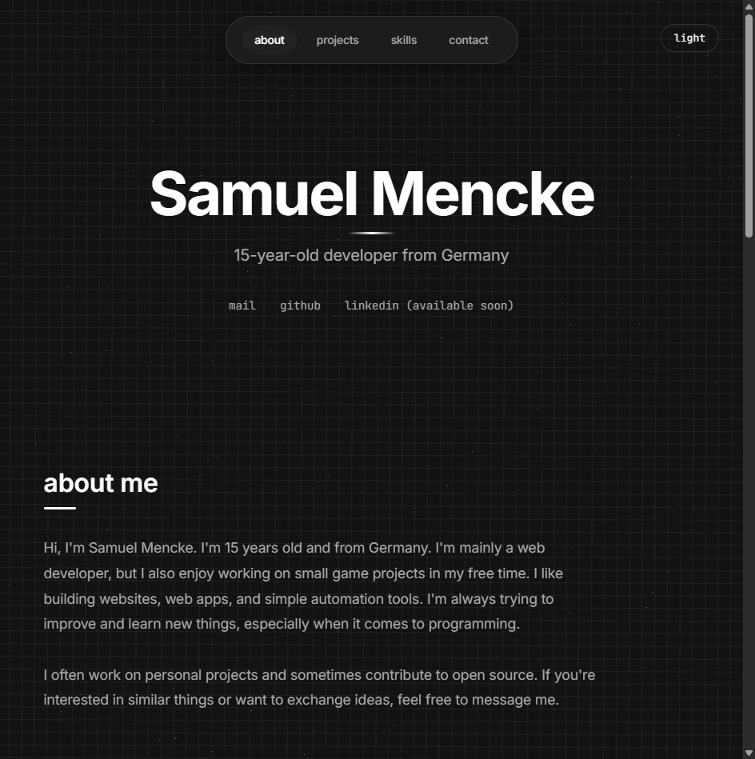
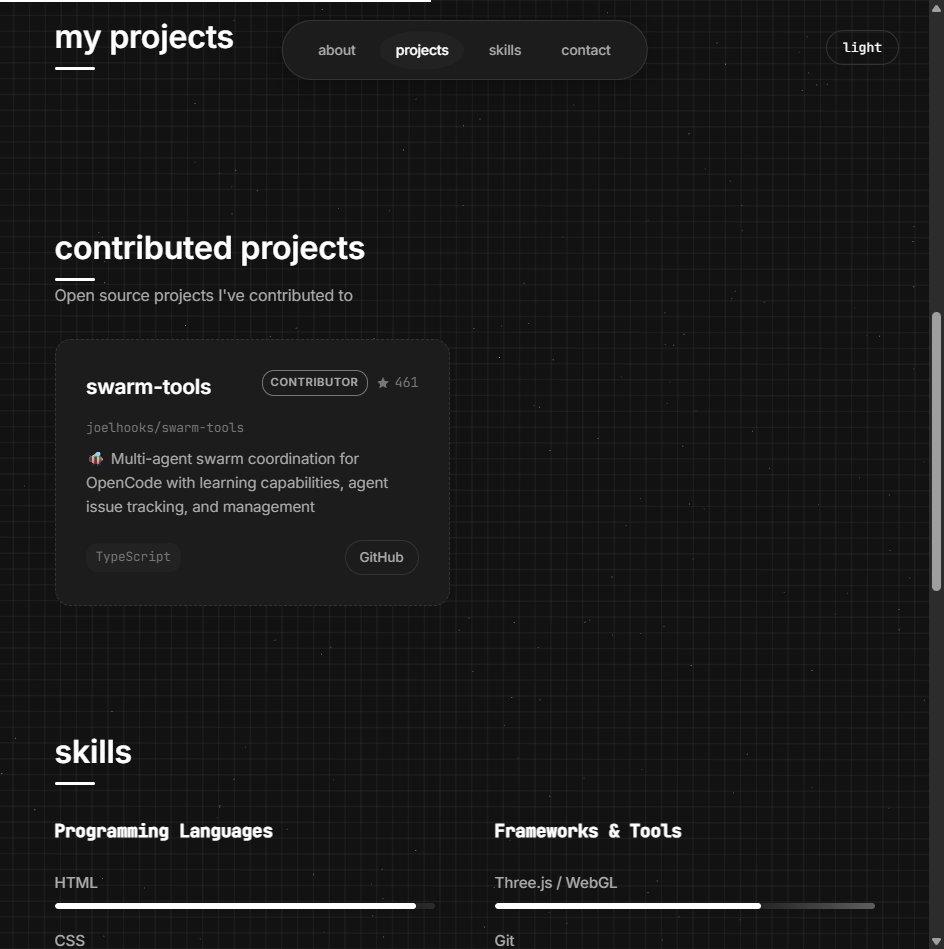
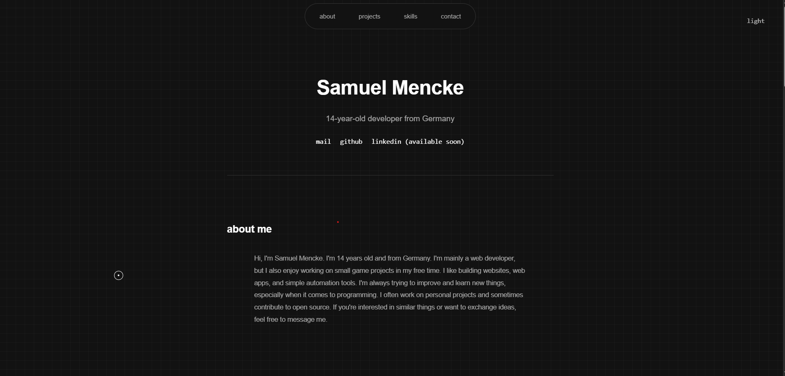
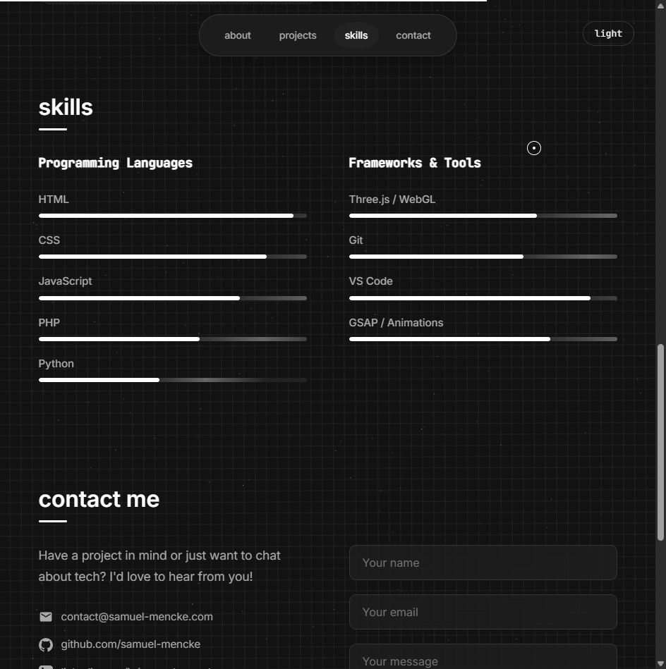
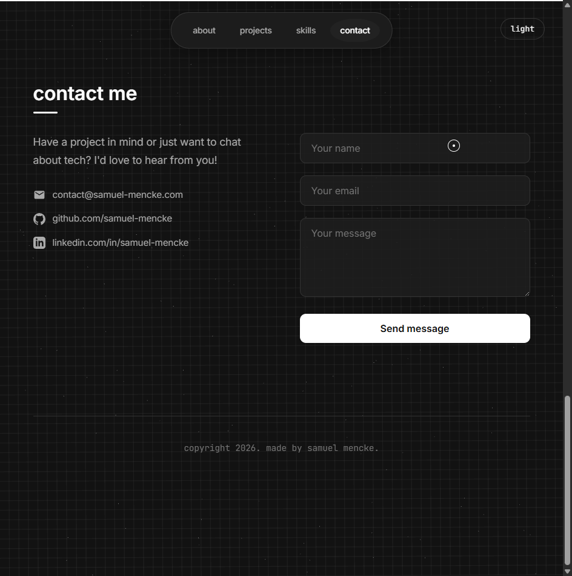

# Samuel Mencke - Portfolio

A modern, interactive portfolio website featuring 3D effects, GitHub API integration, and a clean, minimalist design.

<p align="center">
  
</p>

## 🌟 Features

### Core Features
- **3D Interactive Background** - Animated Three.js particle system
- **GitHub Integration** - Automatically fetches and displays your repositories
- **Project Detail Modal** - Click any project to view README and screenshots
- **Dark/Light Mode** - Automatic theme switching with system preference
- **Responsive Design** - Works perfectly on desktop, tablet, and mobile
- **Contact Form** - Functional contact form with email notifications

### Advanced Features
- **Smart Image Filtering** - Automatically filters out badges, logos, and npm shields
- **Fork Detection** - Shows original repositories for fork contributions
- **Project Blacklist** - Hide specific projects via environment variables
- **Star-based Sorting** - Projects sorted by popularity (GitHub stars)
- **Smooth Animations** - GSAP animations and custom cursor effects

<p align="center">
  
</p>

## 🚀 Quick Start

### Prerequisites
- PHP 8.1 or higher
- GitHub account
- Web server (Apache/Nginx) or PHP built-in server

### Installation

1. **Clone the repository**
   ```bash
   git clone https://github.com/yourusername/portfolio.git
   cd portfolio
   ```

2. **Install dependencies**
   ```bash
   composer install
   ```

3. **Configure environment**
   ```bash
   cp .env.example .env
   # Edit .env with your settings
   ```

4. **Start the server**
   ```bash
   # Using PHP built-in server
   php -S localhost:8000
   
   # Or configure your web server to point to the project root
   ```

5. **Open in browser**
   ```
   http://localhost:8000
   ```

## ⚙️ Configuration

### Basic Setup (Required)

Edit your `.env` file:

```env
# Required
GITHUB_USERNAME=your-github-username

# Recommended (increases API limits)
GITHUB_TOKEN=ghp_your_token_here

# Your domain
APP_URL=https://yourdomain.com
```

### Hiding Projects

To hide specific projects from your portfolio:

```env
HIDDEN_PROJECTS=private-repo,experiment,test-project
```

**Note:** Your profile README repository (username/username) is automatically hidden.

### Contact Form Setup

```env
SMTP_HOST=smtp.gmail.com
SMTP_PORT=587
SMTP_USERNAME=your-email@gmail.com
SMTP_PASSWORD=your-app-password
MAIL_TO_ADDRESS=your-email@example.com
```

## 📸 Screenshots Gallery

<table>
  <tr>
    <td width="50%">
      
      <br>
      <b>Hero Section</b>
      <br>
      <i>Main landing page with animated 3D background and introduction</i>
    </td>
    <td width="50%">
      
      <br>
      <b>About Me</b>
      <br>
      <i>Personal introduction and bio section</i>
    </td>
  </tr>
  <tr>
    <td width="50%">
      
      <br>
      <b>Projects Grid</b>
      <br>
      <i>Interactive 3D project cards with hover effects and GitHub integration</i>
    </td>
    <td width="50%">
      
      <br>
      <b>Project Detail Modal</b>
      <br>
      <i>Detailed project view with image carousel and README content</i>
    </td>
  </tr>
  <tr>
    <td width="50%">
      
      <br>
      <b>Skills Section</b>
      <br>
      <i>Animated skill bars showing proficiency levels in various technologies</i>
    </td>
    <td width="50%">
      
      <br>
      <b>Contact Form</b>
      <br>
      <i>Functional contact form with email validation and SMTP integration</i>
    </td>
  </tr>
</table>

## 📁 Project Structure

```
portfolio/
├── api/                    # API endpoints
│   └── readme.php         # GitHub README fetcher
├── assets/                # Static assets
│   ├── css/              # Stylesheets
│   │   └── style.css
│   ├── js/               # JavaScript files
│   │   ├── main.js       # Main application
│   │   ├── three-scene.js # 3D background
│   │   └── three-projects.js # Project cards
│   └── js/gsap.min.js    # Animation library
├── config/               # Configuration
│   └── env_loader.php
├── images/               # Screenshots and images
│   ├── startpage.png        # Hero section
│   ├── aboutme.png          # About section
│   ├── projektpage.png      # Projects grid
│   ├── skillspage.png       # Skills section
│   ├── contact-mepage.png   # Contact form
│   └── localhost_8000_.png  # Project modal
├── partials/             # PHP partials
│   ├── header.php
│   ├── footer.php
│   └── navbar.php
├── .env                  # Environment variables (not in git)
├── .env.example          # Environment template
├── .gitignore           # Git ignore rules
├── composer.json        # PHP dependencies
├── github_api.php       # GitHub API service
├── index.php           # Main entry point
└── README.md           # This file
```

## 🎨 Customization

### Colors & Theme

Edit CSS variables in `assets/css/style.css`:

```css
:root {
    --primary-text: #000000;
    --secondary-text: #555555;
    --bg-color: #ffffff;
    /* ... more variables */
}

body.dark-mode {
    --primary-text: #ffffff;
    --secondary-text: #aaaaaa;
    --bg-color: #121212;
}
```

### Adding Custom Sections

1. Create a new section in `index.php`:
   ```php
   <section id="custom" class="section">
       <h2 class="section-title">Custom Section</h2>
       <!-- Your content -->
   </section>
   ```

2. Add navigation link in `partials/navbar.php`

3. Style in `assets/css/style.css`

### Modifying 3D Background

Edit `assets/js/three-scene.js`:

```javascript
// Change particle count
const particleCount = 100; // Increase for more particles

// Change colors
const colors = [0x000000, 0x333333, 0x666666]; // Light mode
const darkColors = [0xffffff, 0xcccccc, 0x999999]; // Dark mode
```

## 🔧 Advanced Configuration

### GitHub API Caching

To reduce API calls, responses are cached. Configure cache duration:

```env
GITHUB_CACHE_MINUTES=60
```

### Private Repositories

To include private repositories:

1. Create a GitHub token with `repo` scope
2. Add to `.env`:
   ```env
   GITHUB_TOKEN=ghp_your_token_with_repo_scope
   ```

**Note:** Private repos only show README content, no source code.

### Custom Domain Setup

1. Update `APP_URL` in `.env`
2. Configure DNS to point to your server
3. Set up SSL certificate
4. Update meta tags in `partials/header.php`

## 🐛 Troubleshooting

### API Rate Limit Exceeded

**Problem:** `API rate limit exceeded`

**Solution:** Add a GitHub token to `.env`:
```env
GITHUB_TOKEN=ghp_your_token_here
```

### Images Not Loading

**Problem:** Screenshots not appearing in project modal

**Solution:** 
- Ensure images are in the repository (not just linked externally)
- Check that image files are not in `.gitignore`
- Supported formats: PNG, JPG, JPEG, GIF, WEBP, SVG

### Contact Form Not Working

**Problem:** Emails not being sent

**Solution:**
1. Check SMTP settings in `.env`
2. For Gmail, use an App Password (not your regular password)
3. Enable "Less secure app access" if not using App Password
4. Check PHP mail configuration

### 3D Background Not Showing

**Problem:** Black background instead of 3D animation

**Solution:**
1. Check browser console for errors
2. Ensure Three.js is loading: `https://cdnjs.cloudflare.com/ajax/libs/three.js/r128/three.min.js`
3. Disable ad blockers that might block CDNs

## 📱 Browser Support

- ✅ Chrome 80+
- ✅ Firefox 75+
- ✅ Safari 13+
- ✅ Edge 80+
- ✅ Mobile Safari (iOS 13+)
- ✅ Chrome Mobile (Android 10+)

## 🛡️ Security

- Environment variables are never exposed to client
- GitHub token is server-side only
- Contact form has CSRF protection
- Input sanitization on all user inputs
- SQL injection prevention (if using database)

## 📝 License

This project is open source and available under the [MIT License](LICENSE).

## 🤝 Contributing

Contributions are welcome! Please feel free to submit a Pull Request.

1. Fork the repository
2. Create your feature branch (`git checkout -b feature/AmazingFeature`)
3. Commit your changes (`git commit -m 'Add some AmazingFeature'`)
4. Push to the branch (`git push origin feature/AmazingFeature`)
5. Open a Pull Request

## 📚 Documentation

- [Changelog](CHANGELOG.md) - Version history and updates
- [Contributing Guide](CONTRIBUTING.md) - How to contribute
- [Env Example](.env.example) - Configuration reference

## 📧 Contact

Samuel Mencke - [contact@samuel-mencke.com](mailto:contact@samuel-mencke.com)

Project Link: [https://github.com/Samuel-Mencke/portfolio](https://github.com/Samuel-Mencke/portfolio)

---
